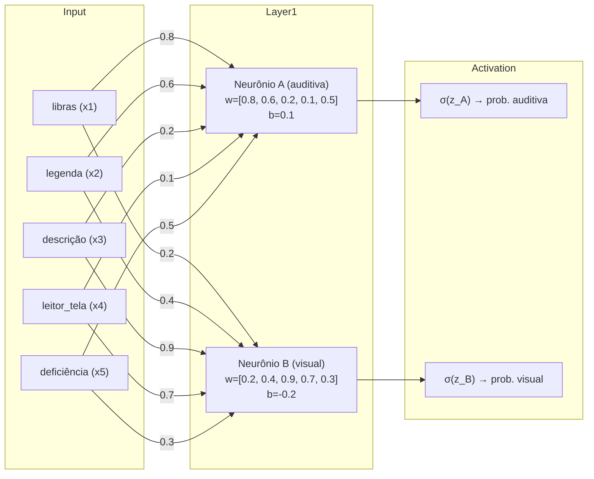

# Ponderada - Feedforward de Rede Neural (Semana 07)

## Contexto do Enunciado

Foi proposta à turma uma **Ponderada de Feedforward de Redes Neurais** na aula de **Funções de Ativação (Semana 07)**. Devemos calcular a saída da primeira camada de uma rede neural que utiliza **Bag-of-Words (BoW)** para classificar se um trecho de texto apresenta indícios de **acessibilidade auditiva** e/ou **acessibilidade visual**. O vocabulário do BoW contém cinco termos, nesta ordem: **libras**, **legenda**, **descrição**, **leitor\_tela** e **deficiência**. Cada frase é representada como um vetor binário de cinco posições, indicando presença (1) ou ausência (0) de cada palavra do vocabulário. As três frases fornecidas já estão vetorizadas como:

* **P1** = \[1, 1, 0, 0, 1]
* **P2** = \[0, 0, 1, 1, 1]
* **P3** = \[1, 1, 1, 0, 0]

A primeira camada da rede possui **dois neurônios**. O **Neurônio A** está calibrado para detectar **acessibilidade auditiva** (por exemplo, Libras e legendas), enquanto o **Neurônio B** está calibrado para **acessibilidade visual** (por exemplo, descrições de imagem e compatibilidade com leitores de tela). Cada neurônio possui um vetor de **pesos** (um peso por palavra do vocabulário) e um **bias** (viés). Após a soma ponderada com o bias, aplicamos a **função sigmoide** para obter uma probabilidade entre 0 e 1, que interpretaremos como a força de evidência de acessibilidade para cada dimensão (auditiva ou visual).

---

## Análise da Rede

Do ponto de vista de Engenharia de Software, esta primeira camada é uma **camada densa** de dimensão 2, recebendo um vetor de dimensão 5. Para um neurônio genérico, a saída linear (pré-ativação) é

$$
z = w \cdot x + b = \sum_{i=1}^{5} w_i x_i + b,
$$

em que $x$ é o vetor BoW da frase, $w$ é o vetor de pesos do neurônio e $b$ é o bias.

Em seguida, aplicamos a **sigmoide**:

$$
\sigma(z) = \frac{1}{1 + e^{-z}},
$$

que mapeia qualquer número real $z$ para o intervalo $(0,1)$. Valores mais próximos de 1 indicam maior evidência para a classe que o neurônio representa.

Os **pesos** e **biases** informados são:

* **Neurônio A (auditiva)**: $w_A = [0.8,\; 0.6,\; 0.2,\; 0.1,\; 0.5]$, $b_A = 0.1$.
  Observa-se que **libras** (0.8) e **legenda** (0.6) têm maior influência positiva neste neurônio, coerente com a intuição de acessibilidade auditiva.

* **Neurônio B (visual)**: $w_B = [0.2,\; 0.4,\; 0.9,\; 0.7,\; 0.3]$, $b_B = -0.2$.
  Aqui, **descrição** (0.9) e **leitor\_tela** (0.7) têm maior peso, o que reflete boas práticas para pessoas com deficiência visual.

---

## Cálculo

Passo a passo, calculo primeiro as **saídas lineares** $z$ de cada neurônio para cada frase e, em seguida, aplico a sigmoide.

### P1 = $[1, 1, 0, 0, 1]$

**Neurônio A (auditiva)**

$$
\begin{aligned}
z_A(P1) &= 0.8(1)+0.6(1)+0.2(0)+0.1(0)+0.5(1)+0.1 \\
        &= 0.8 + 0.6 + 0 + 0 + 0.5 + 0.1 \\
        &= 2.0 \\
\sigma(z_A(P1)) &\approx \frac{1}{1+e^{-2.0}} \approx 0.8808
\end{aligned}
$$

**Neurônio B (visual)**

$$
\begin{aligned}
z_B(P1) &= 0.2(1)+0.4(1)+0.9(0)+0.7(0)+0.3(1) - 0.2 \\
        &= 0.2 + 0.4 + 0 + 0 + 0.3 - 0.2 \\
        &= 0.7 \\
\sigma(z_B(P1)) &\approx \frac{1}{1+e^{-0.7}} \approx 0.6682
\end{aligned}
$$

### P2 = $[0, 0, 1, 1, 1]$

**Neurônio A (auditiva)**

$$
\begin{aligned}
z_A(P2) &= 0.8(0)+0.6(0)+0.2(1)+0.1(1)+0.5(1)+0.1 \\
        &= 0 + 0 + 0.2 + 0.1 + 0.5 + 0.1 \\
        &= 0.9 \\
\sigma(z_A(P2)) &\approx \frac{1}{1+e^{-0.9}} \approx 0.7110
\end{aligned}
$$

**Neurônio B (visual)**

$$
\begin{aligned}
z_B(P2) &= 0.2(0)+0.4(0)+0.9(1)+0.7(1)+0.3(1) - 0.2 \\
        &= 0 + 0 + 0.9 + 0.7 + 0.3 - 0.2 \\
        &= 1.7 \\
\sigma(z_B(P2)) &\approx \frac{1}{1+e^{-1.7}} \approx 0.8455
\end{aligned}
$$

### P3 = $[1, 1, 1, 0, 0]$

**Neurônio A (auditiva)**

$$
\begin{aligned}
z_A(P3) &= 0.8(1)+0.6(1)+0.2(1)+0.1(0)+0.5(0)+0.1 \\
        &= 0.8 + 0.6 + 0.2 + 0 + 0 + 0.1 \\
        &= 1.7 \\
\sigma(z_A(P3)) &\approx \frac{1}{1+e^{-1.7}} \approx 0.8455
\end{aligned}
$$

**Neurônio B (visual)**

$$
\begin{aligned}
z_B(P3) &= 0.2(1)+0.4(1)+0.9(1)+0.7(0)+0.3(0) - 0.2 \\
        &= 0.2 + 0.4 + 0.9 + 0 + 0 - 0.2 \\
        &= 1.3 \\
\sigma(z_B(P3)) &\approx \frac{1}{1+e^{-1.3}} \approx 0.7858
\end{aligned}
$$

---

## Resultados

Em termos numéricos, as probabilidades finais (após a sigmoide) para cada frase e cada neurônio ficaram:

| Frase  | Vetor $[libras,\;legenda,\;descrição,\;leitor\_tela,\;deficiência]$ | $z_A$ | $\sigma(z_A)$ | $z_B$ | $\sigma(z_B)$ |
| ------ | ------------------------------------------------------------------- | ----: | ------------: | ----: | ------------: |
| **P1** | \[1, 1, 0, 0, 1]                                                    | 2.000 |     **0.881** | 0.700 |     **0.668** |
| **P2** | \[0, 0, 1, 1, 1]                                                    | 0.900 |     **0.711** | 1.700 |     **0.846** |
| **P3** | \[1, 1, 1, 0, 0]                                                    | 1.700 |     **0.846** | 1.300 |     **0.786** |

Para visualização da arquitetura (entrada BoW → neurônios da 1ª camada → ativações sigmoides), segue um diagrama **Mermaid** que deixa explícitas as conexões e os pesos principais:

---

## Interpretação

Interpretando como um aluno de Engenharia de Software explicaria à professora: os resultados refletem exatamente o que os pesos sinalizam. O **Neurônio A** sobe de forma mais contundente quando a frase contém **libras** e **legenda**, o que é coerente com conteúdos voltados a pessoas com **deficiência auditiva**. Na prática, **P1** apresenta ambos e, por isso, alcança $\sigma(z_A)\approx 0.88$, um valor alto que sugere forte evidência auditiva; para o visual, P1 fica em torno de 0.67, apontando sinais mais moderados pois faltaram **descrição** e **leitor\_tela**, que são os maiores propulsores do Neurônio B.

Já **P2** traz **descrição** e **leitor\_tela**, e por isso o **Neurônio B (visual)** dispara para $\sigma(z_B)\approx 0.85$, indicando boa conformidade para acessibilidade visual. Ao mesmo tempo, P2 também atinge $\sigma(z_A)\approx 0.71$, um patamar razoável para auditiva, impulsionado por pesos menores (como **deficiência**) e pelo bias positivo do neurônio A.

Por fim, **P3** combina **libras**, **legenda** e **descrição**. Essa composição “híbrida” eleva tanto o Neurônio A ($\approx 0.85$) quanto o Neurônio B ($\approx 0.79$), embora, no caso visual, a ausência de **leitor\_tela** impeça que o valor chegue tão alto quanto em P2. Em uma regra simples de decisão (por exemplo, classificar como “presente” quando a probabilidade é ≥ 0,70), teríamos: P1 claramente **auditiva**; P2 claramente **visual** e também **auditiva**; P3 **auditiva** e **visual**. Em termos de produto e conteúdo, eu comunicaria que **P2 e P3** demonstram boas práticas **multimodais**, cobrindo tanto necessidades de usuários com deficiência visual quanto auditiva, enquanto **P1** foca com excelência na dimensão auditiva e carece de elementos específicos de acessibilidade visual (como descrição de imagens e compatibilidade explícita com leitores de tela).

Em resumo, a camada implementa uma **pontuação linear** por dimensão de acessibilidade, seguida de uma **normalização sigmoide** para interpretação probabilística. Os pesos, ao refletirem a semântica do domínio, tornam a explicação coerente e auditável: **descrição** e **leitor\_tela** puxam o neurônio visual; **libras** e **legenda** puxam o neurônio auditivo. Essa transparência é útil para ajustar thresholds de classificação e orientar equipes de conteúdo a incluir o elemento de acessibilidade mais faltante em cada caso.
